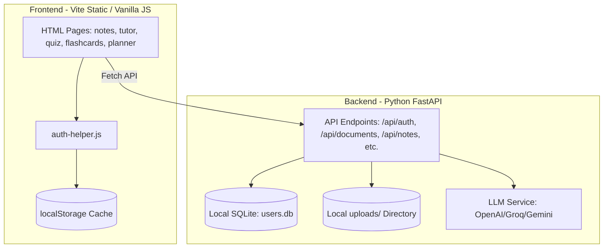

# StudyMate AI — Backend Migration Audit (to Supabase)

This document outlines the current backend and frontend architecture of **StudyMate AI** and details the plan to migrate it to **Supabase** as the primary production backend.

---

## 1. Current Project Architecture

The application is structured into two main parts:
- **Frontend**: A static-site/multi-page setup served by Vite. Pages are raw HTML files in the `frontend` root, using CSS variables and importing vanilla JS files. It has an inactive React skeleton app inside the `frontend/src` directory.
- **Backend**: A Python FastAPI server (`backend/main.py`) running on `http://127.0.0.1:8000`.



---

## 2. Current Frontend Framework

- **Vite** serves as the build tool and local dev server.
- The user interface is built using standard multi-page HTML (`index.html`, `login.html`, `notes.html`, `flashcards.html`, `quiz.html`, `tutor.html`, `planner.html`, `about.html`, `contact.html`).
- The actual styling uses Vanilla CSS with a curated, modern dark/neon aesthetic.
- A skeleton React app exists in `frontend/src` but is not loaded or used by the main application pages.
- Authentication state and user progress data are cached locally using the browser's `localStorage` (`sm_auth_token`, `sm_user`, `sm_chats`, `sm_notes`, `sm_quiz_highscore`, `sm_cards`, `sm_planner_plan`, `sm_tickets`).

---

## 3. Current Backend Implementation

- **Framework**: Python FastAPI (`uvicorn` server).
- **Database**: SQLite (`users.db`), queried using the standard `sqlite3` library with raw SQL commands.
- **Authentication**: JWT-based session tokens using HS256 (`PyJWT`).
- **File Upload & Parsing**: Local disk file storage (`uploads/<user_id>/`), running text extraction asynchronously via PyMuPDF, python-docx, and python-pptx, then caching the raw text in the SQLite database.
- **LLM Integrations**: OpenAI, Groq, and Google Gemini API clients, with streaming support using SSE.

---

## 4. Existing Authentication System

- Custom password registration (`POST /api/auth/register`) and login (`POST /api/auth/login`) with `bcrypt` password hashing (rounds=12).
- Session token generation (JWT HS256 signed with a runtime-mandatory `JWT_SECRET`).
- Rate limiting implemented on the login route using `slowapi` (5 attempts per 15 minutes per IP).
- Firebase Custom Token verification route (`POST /api/auth/firebase-login`) using the Firebase Admin SDK.

---

## 5. Existing Database or Mock-Data Sources

- **Production / Online Mode**: SQLite database (`backend/users.db`) with tables:
  - `users`: stores email, password hash, full name.
  - `user_sync`: stores a single record per user holding JSON strings of `chats`, `notes`, `quiz_highscore`, `cards`, `planner_plan`, and `tickets`.
  - `documents`: stores metadata (`id`, `filename`, `file_type`, `file_size`, `file_path`) and `extracted_text`.
- **Offline Mode**: Local browser fallback using mock functions:
  - `generateMockNotes()` in `notes.html`
  - Mock quizzes in `quiz.html`
  - Mock flashcards in `flashcards.html`
  - Mock tutor responses in `tutor.html`
  - Mock planner calendar in `planner.html`

---

## 6. Every Feature That Requires Persistent Data

1. **User Auth & Profiles**: signup, signin, session state, user name, and email.
2. **Cloud Sync & Data Persistence**: backing up and restoring localStorage data (chats, notes, highscores, cards, planner schedule, tickets).
3. **Study Documents**: document upload metadata, file path, file content (stored on disk), and extracted text.

---

## 7. Every Frontend Page That Depends on Backend Data

- `login.html`: authentication endpoints (`/auth/register`, `/auth/login`, `/auth/sync`).
- `index.html`: dashboard stats derived from localStorage keys, which are fetched/restored from `/auth/sync`.
- `notes.html`, `tutor.html`, `quiz.html`, `flashcards.html`:
  - Upload file: `/documents/upload`
  - List files: `/documents`
  - Get details: `/documents/{id}`
  - Delete file: `/documents/{id}`
  - Generation endpoints: `/notes`, `/notes/stream`, `/tutor`, `/tutor/stream`, `/quiz`, `/flashcards`, `/key-points`.
- `planner.html`: study plan generation `/planner`.

---

## 8. Existing API Endpoints

- Auth:
  - `POST /api/auth/register`
  - `POST /api/auth/login`
  - `GET /api/auth/me`
  - `POST /api/auth/sync`
  - `GET /api/auth/sync`
  - `POST /api/auth/firebase-login`
- Documents:
  - `POST /api/documents/upload`
  - `GET /api/documents`
  - `GET /api/documents/{document_id}`
  - `DELETE /api/documents/{document_id}`
- AI Generation:
  - `POST /api/tutor`
  - `POST /api/tutor/stream`
  - `POST /api/notes`
  - `POST /api/quiz`
  - `POST /api/flashcards`
  - `POST /api/key-points`
  - `POST /api/planner`

---

## 9. Existing File-Upload Functionality

- File uploaded via multipart form data to `/api/documents/upload`.
- Allowed formats: `.pdf`, `.docx`, `.doc`, `.pptx`, `.ppt`, `.txt`.
- Max size: 20MB.
- Text is extracted asynchronously in a Python worker thread and updated in the DB.
- Files are saved locally to `backend/uploads/<user_id>`.

---

## 10. Existing AI Functionality

- Integrated using OpenAI API Client wrapper (fallback order Groq -> OpenAI -> Gemini).
- Injects `document_context` if `document_id` is supplied.
- Stream tutor responses using SSE (`StreamingResponse`).
- Supports tutor personas: Beginner Tutor, Exam Coach, Professor, Friendly Mentor.

---

## 11. Existing User Roles and Permissions

- Flat user system: all registered users have the same permissions.
- Document and sync ownership: verified via JWT `user_id`. SQLite queries enforce that `user_id` matches the token.

---

## 12. Security Problems Discovered

- **SQLite Database**: Local SQLite databases do not scale, lack automatic backups, and can experience write locks.
- **Local File Storage**: Files are saved to local server directories. A server restart, container recreation, or crash can wipe user uploads.
- **Firebase/SQLite hybrid**: Split authentication makes credentials management complex.
- **Loose CORS policy**: Backend CORS config allows `allow_origins=["*"]`.

---

## 13. Files That Need Modification

### Backend
- `backend/requirements.txt`: add `supabase`.
- `backend/services/db_service.py`: rewrite to use Supabase PostgreSQL via the Supabase Python SDK.
- `backend/services/auth_service.py`: replace standard HS256 decoding/encryption with Supabase Auth validation.
- `backend/services/document_service.py`: update file-saving/deletion/reading to use Supabase Private Storage Buckets.
- `backend/main.py`: remove SQLite database initialization, update startup checks, update health logs.
- `backend/routes/auth.py`: route auth operations through Supabase Auth.
- `backend/routes/documents.py`: route metadata queries and uploads through Supabase.

### Frontend
- `frontend/auth-helper.js`: migrate token management, registration, sign-in, profile queries, and sync logic to utilize the Supabase JavaScript SDK.
- All HTML pages (`login.html`, `notes.html`, `tutor.html`, `quiz.html`, `flashcards.html`, `planner.html`): update backend request headers and structure to match Supabase requirements.

---

## 14. Files That May Be Safely Removed

- `backend/users.db` (local SQLite file)
- `backend/routes/firebase_auth.py` (decommissioned Firebase auth endpoint)
- `backend/uploads/` directory on disk (migrating to Supabase Storage)

---

## 15. Proposed Supabase Architecture

### Database Schema

We will create three tables in the Supabase PostgreSQL database:

```sql
-- 1. Profiles Table (extends auth.users)
CREATE TABLE public.profiles (
    id UUID PRIMARY KEY REFERENCES auth.users ON DELETE CASCADE,
    email TEXT UNIQUE NOT NULL,
    full_name TEXT NOT NULL,
    created_at TIMESTAMP WITH TIME ZONE DEFAULT timezone('utc'::text, now()) NOT NULL
);

-- Enable RLS on Profiles
ALTER TABLE public.profiles ENABLE ROW LEVEL SECURITY;
CREATE POLICY "Users can view own profile" ON public.profiles FOR SELECT USING (auth.uid() = id);
CREATE POLICY "Users can update own profile" ON public.profiles FOR UPDATE USING (auth.uid() = id);

-- 2. User Sync Table (persistent user progress)
CREATE TABLE public.user_sync (
    user_id UUID PRIMARY KEY REFERENCES public.profiles(id) ON DELETE CASCADE,
    chats TEXT,
    notes TEXT,
    quiz_highscore TEXT,
    cards TEXT,
    planner_plan  TEXT,
    tickets       TEXT,
    updated_at TIMESTAMP WITH TIME ZONE DEFAULT timezone('utc'::text, now()) NOT NULL
);

-- Enable RLS on User Sync
ALTER TABLE public.user_sync ENABLE ROW LEVEL SECURITY;
CREATE POLICY "Users can access own sync progress" ON public.user_sync FOR ALL USING (auth.uid() = user_id);

-- 3. Documents Table (uploaded study documents)
CREATE TABLE public.documents (
    id UUID PRIMARY KEY DEFAULT gen_random_uuid(),
    user_id UUID NOT NULL REFERENCES public.profiles(id) ON DELETE CASCADE,
    filename TEXT NOT NULL,
    file_path TEXT NOT NULL,
    file_type TEXT NOT NULL,
    file_size INTEGER NOT NULL,
    extracted_text TEXT,
    created_at TIMESTAMP WITH TIME ZONE DEFAULT timezone('utc'::text, now()) NOT NULL
);

-- Enable RLS on Documents
ALTER TABLE public.documents ENABLE ROW LEVEL SECURITY;
CREATE POLICY "Users can access own documents" ON public.documents FOR ALL USING (auth.uid() = user_id);
```

### Profile Creation Trigger
To keep `public.profiles` and `public.user_sync` in sync with Supabase Auth:
```sql
CREATE OR REPLACE FUNCTION public.handle_new_user()
RETURNS trigger AS $$
BEGIN
  INSERT INTO public.profiles (id, email, full_name)
  VALUES (
    new.id,
    new.email,
    COALESCE(new.raw_user_meta_data->>'full_name', 'StudyMate User')
  );
  
  INSERT INTO public.user_sync (user_id)
  VALUES (new.id);

  RETURN new;
END;
$$ LANGUAGE plpgsql SECURITY DEFINER;

CREATE TRIGGER on_auth_user_created
  AFTER INSERT ON auth.users
  FOR EACH ROW EXECUTE FUNCTION public.handle_new_user();
```

### Storage Buckets
- Create a private bucket called `documents`.
- Folder structure: `uploads/{user_id}/{document_id}_{filename}`.
- Storage RLS Policy: Users can upload, read, and delete files only inside their own `uploads/{auth.uid()}/` folder.

---

## 16. Proposed Migration Order

1. **Step 1**: Write SQL definitions for tables, RLS policies, triggers, and storage buckets. Provide them to the user.
2. **Step 2**: Install `@supabase/supabase-js` on the frontend and `supabase` client on the backend.
3. **Step 3**: Configure framework environment variables for Supabase (VITE_ / backend).
4. **Step 4**: Port backend Database Service (`db_service.py`) and Auth Service (`auth_service.py`) to interface with Supabase PostgreSQL and verify Supabase JWT signatures.
5. **Step 5**: Port Document Service (`document_service.py`) to save uploaded files to Supabase Storage Buckets instead of local disk.
6. **Step 6**: Update frontend `auth-helper.js` and `login.html` to authenticate directly with Supabase.
7. **Step 7**: Update frontend HTML pages to upload files directly to Supabase storage, or route them through FastAPI using the Supabase authorization headers.
8. **Step 8**: Complete validation, run test scripts, verify offline fallback is bypassed when logged in.
